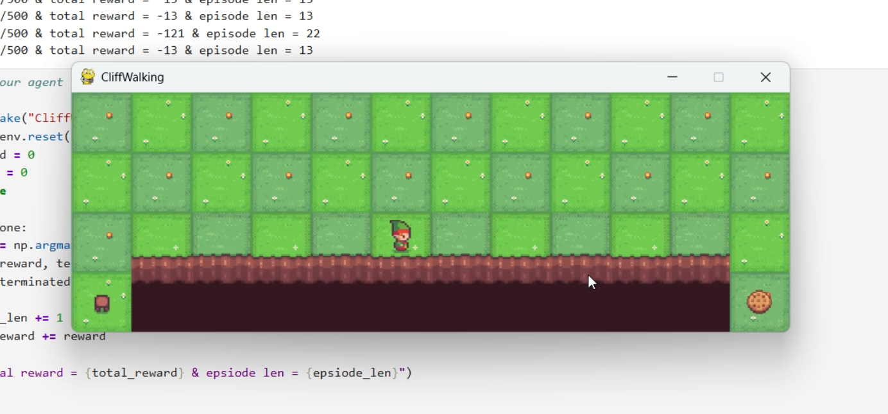

# 📘 Cliff Walking RL: SARSA vs Q-Learning

## 🚀 Overview
This project implements and compares **SARSA (on-policy)** and **Q-Learning (off-policy)** algorithms on the classic Cliff Walking environment.  
The objective is to analyze how different learning strategies affect **policy optimality, risk handling, and convergence**.

---

## 🧠 Algorithms Implemented

### 🔹 SARSA (On-Policy)
- Learns from actions actually taken  
- More conservative strategy  
- Avoids the cliff (safer path)  

### 🔹 Q-Learning (Off-Policy)
- Learns optimal action independent of current policy  
- Converges to shortest path  
- Higher risk (closer to cliff)  

---

## ⚙️ Features
- ε-greedy exploration strategy  
- Tabular Q-value updates  
- Episode-wise reward tracking  
- Policy visualization  
- Performance comparison between algorithms  

---

## 📷 Demo

  

  Agent navigating the Cliff Walking grid using a learned policy

---

## 📊 Results & Insights

- SARSA learns a safe path, avoiding the cliff consistently  
- Q-Learning learns the optimal shortest path but may fall during exploration  
- Demonstrates the trade-off between safety vs optimality  
- Highlights the difference between on-policy and off-policy learning  

---
## 👤 Author
**Abhishek Marigeri**

---

## ⭐ Support
If you found this project useful, consider giving it a ⭐ on GitHub!
